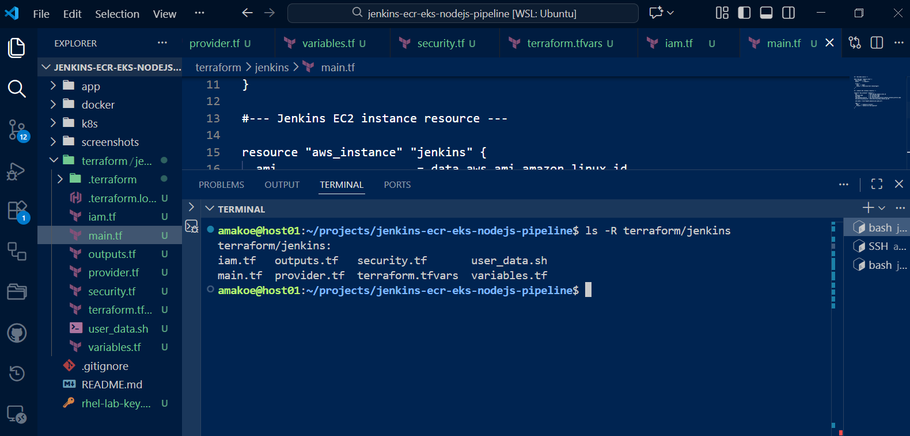
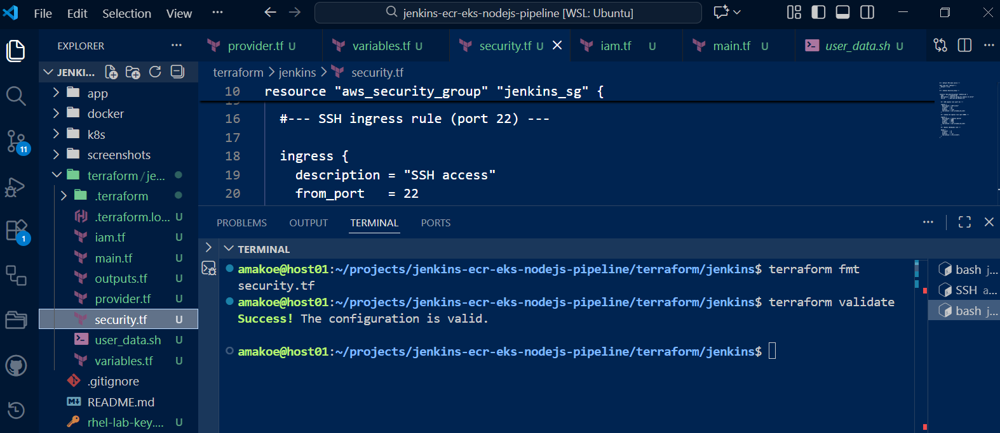

# --- Jenkins - ECR - EKS Node.js CI/CD Pipeline ---

# --- Overview ---
This project implements a production-aligned CI/CD and deployment workflow for a Dockerized Node.js application using Jenkins, Amazon ECR, and Amazon EKS, with all infrastructure provisioned through Terraform.

The pipeline automates the build and packaging of the application, securely publishes container images to Amazon ECR, and deploys the application into an Amazon EKS cluster using Kubernetes manifests. The project emphasizes Infrastructure as Code, IAM-based security, reproducibility, and cost-aware cloud practices.

---

# --- Architecture ---
High-level workflow:

1. Developer pushes source code to GitHub

2. Jenkins pulls the repository using SSH authentication

3. Jenkins builds a Docker image for the Node.js application

4. Jenkins authenticates to Amazon ECR using an attached IAM role

5. The image is versioned and pushed to Amazon ECR

6. The application image is deployed into Amazon EKS using Kubernetes

### Infrastructure Provisioning (Terraform)

The Jenkins CI server infrastructure is provisioned using Terraform to ensure repeatable, auditable, and production-aligned deployment.

Terraform configuration is validated before deployment to prevent misconfiguration and ensure consistency across environments.

---

# --- Tech Stack ---
- Jenkins (CI/CD)
- Terraform (Infrastructure as Code)
- AWS (EC2, ECR, IAM)
- Docker (Containerization)
- Node.js (Application)
- GitHub (Source Control, SSH access)

---

# --- Project Structure ---
jenkins-ecr-eks-nodejs-pipeline/
├── app/                     # Node.js application
├── docker/                  # Dockerfile
├── k8s/
│   ├── deployment.yaml      # Kubernetes Deployment
│   └── service.yaml         # Kubernetes Service
├── terraform/
│   ├── jenkins/             # Jenkins infrastructure (Terraform)
│   └── eks/                 # EKS cluster and node groups (Terraform)
├── Jenkinsfile
├── screenshots/
└── README.md

---

# --- CI/CD Pipeline Flow ---
The Jenkins pipeline executes the following stages:

- The Jenkins pipeline executes the following stages:

- Checkout – Pulls source code from GitHub

- Build Docker Image – Builds the Node.js container image

- Authenticate to ECR – Uses AWS CLI with EC2 IAM role

- Tag & Push Image – Publishes versioned images to Amazon ECR

Images are tagged using the Jenkins build number to ensure traceability and immutability across deployments.

---

#---Kubernetes Deployment (Amazon EKS) ---

Deployment

- Kubernetes Deployment with multiple replicas

- Application container listens on port 3000

- Image pulled directly from Amazon ECR

Service

- Kubernetes Service used to provide internal service routing

- Service configuration verified independently of CI automation

#--- Application Verification ---

The application was validated inside the EKS cluster using Kubernetes port-forwarding, which provides a reliable and Kubernetes-native method to verify container execution, service routing, and runtime behavior.

kubectl port-forward svc/nodejs-demo-service 8080:80

Application access:
curl http://localhost:8080

Example response:
{"service":"Jenkins → ECR → EKS Pipeline","status":"running"}

External exposure via cloud load balancers was intentionally not finalized to keep the demo environment focused, cost-efficient, and aligned with Kubernetes-native validation practices.

#--- Security Considerations ---

- IAM roles used instead of static AWS credentials

- Least-privilege permissions applied to Jenkins and EKS components

- No secrets committed to source control

- Infrastructure components isolated using separate Terraform configurations

#--- Key Takeaways ---

This project demonstrates:

- End-to-end CI/CD design using Jenkins and AWS

- Infrastructure provisioning with Terraform

- Secure container image management using Amazon ECR

- Kubernetes deployment and service routing in Amazon EKS

- Real-world troubleshooting of AWS and Kubernetes networking

- Cost-aware decision-making in cloud environments

#--- Future Enhancements ---

- Jenkins → EKS automated deployment stage

- IAM Roles for Service Accounts (IRSA)

- Ingress controller with HTTPS

- Container image vulnerability scanning

- Helm-based Kubernetes deployments

#--- Author ---

Amakoe
Cloud / DevOps Engineer
Focus areas: AWS, Terraform, Kubernetes, CI/CD, DevSecOps